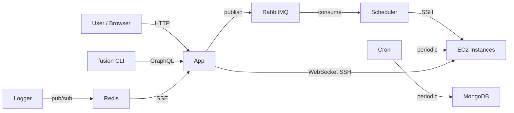

# Services Overview

The Stardust platform runs a set of background services that handle
container orchestration, periodic maintenance, real-time log
distribution, and HTTP routing. All services are deployed as AWS
ECS Fargate tasks and communicate via RabbitMQ, Redis, and direct
HTTP.

## Architecture

```
AWS ECS Fargate
├── App Service          (Express + Apollo)  :4000
├── Scheduler Service                         (queue consumers)
├── Cron Service                              (periodic tasks)
└── Logger Service                            (log collector)
```

| Service                        | Responsibility                                                        | Trigger                       |
| ------------------------------ | --------------------------------------------------------------------- | ----------------------------- |
| [Scheduler](./scheduler)       | Executes container operations (deploy, build, destroy, spot recovery) | RabbitMQ messages             |
| [Cron](./cron)                 | Periodic health checks and cleanup                                    | Time-based intervals          |
| [Logger](./logger)             | Streams container logs to Redis pub/sub                               | stdout/stderr from containers |
| [Docker Proxy](./docker-proxy) | Routes HTTP traffic from custom domains to containers                 | Inbound HTTP requests         |

## How They Fit Together



- **App** is the request-facing entry point. Mutations that change
  state (creating a container, triggering a rebuild) publish a
  message to RabbitMQ and return.
- **Scheduler** is the only service that _executes_ container
  operations. It consumes the queued messages, acquires locks
  via Redlock, SSHes into EC2 builder/spot instances, and runs
  the actual Docker commands.
- **Cron** runs housekeeping on a schedule — pinging dead
  instances, removing terminated containers, and terminating
  unused EC2 capacity.
- **Logger** is a sidecar that tails container stdout/stderr
  and re-publishes each line on a Redis channel keyed by
  container ID. The App's SSE route subscribes and forwards to
  the browser.
- **Docker Proxy** is not a Fargate service — it runs on a
  dedicated EC2 instance and is the only path from the public
  internet to a user's container. It reads container-to-port
  mappings from Redis and proxies HTTP requests accordingly.

## See Also

- [System Architecture](../architecture) — the full diagram
  with Frontend, Backend, Data, and Infrastructure layers
- [Backend Overview](../backend/overview) — the App service
  in more detail
- [Infrastructure Overview](../infrastructure/overview) — the
  AWS resources that host these services
